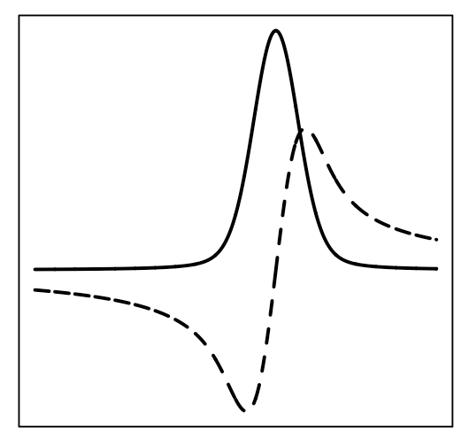

Wrapper to the [Faddeeva Package by Steven G.
Johnson](http://ab-initio.mit.edu/wiki/index.php/Faddeeva_Package)

## What is Faddeeva?

The [Faddeeva](http://ab-initio.mit.edu/wiki/index.php/Faddeeva_Package)
package provides C++ code to compute the various error functions of
arbitrary complex arguments, in particular the Faddeeva function, error
function, complementary error function, scaled complementary error
function and imaginary error function as well as the Dawson function.
With these, Voigt functions, Fresnel integrals and more can be computed.

### Why this package?

The package was created to provide a fast implementation of the Voigt
lineshape, formally defined as the convolution between a Lorentzian and
a Gaussian. The imaginary part of the Faddeeva function, properly
scaled, provides directly the result.

This package also results in a nice example for creating Rcpp wrappers
for a small and self-contained C++ library, in this case a single header
file along with a single code file.
